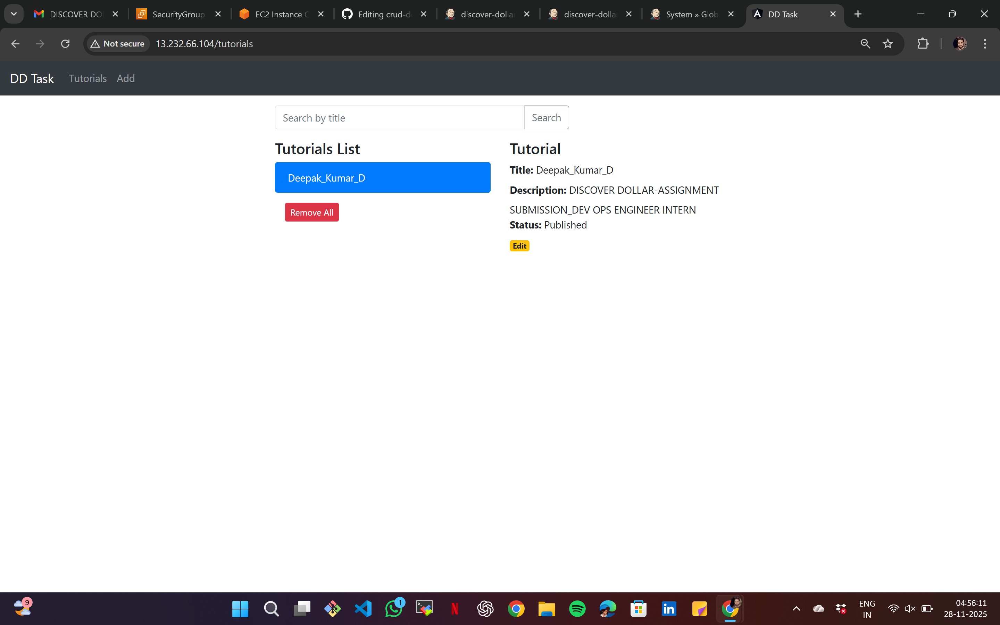
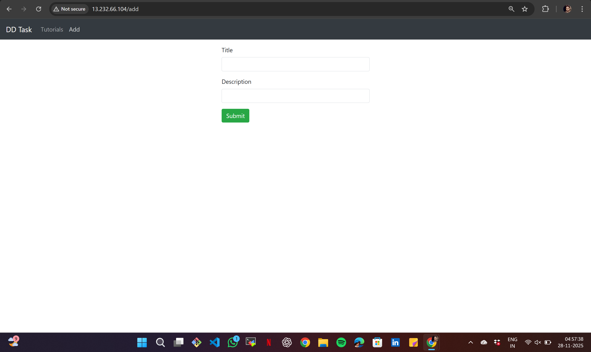
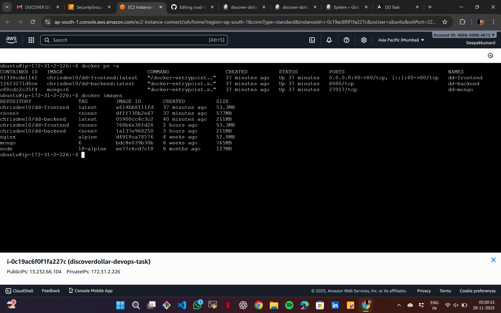
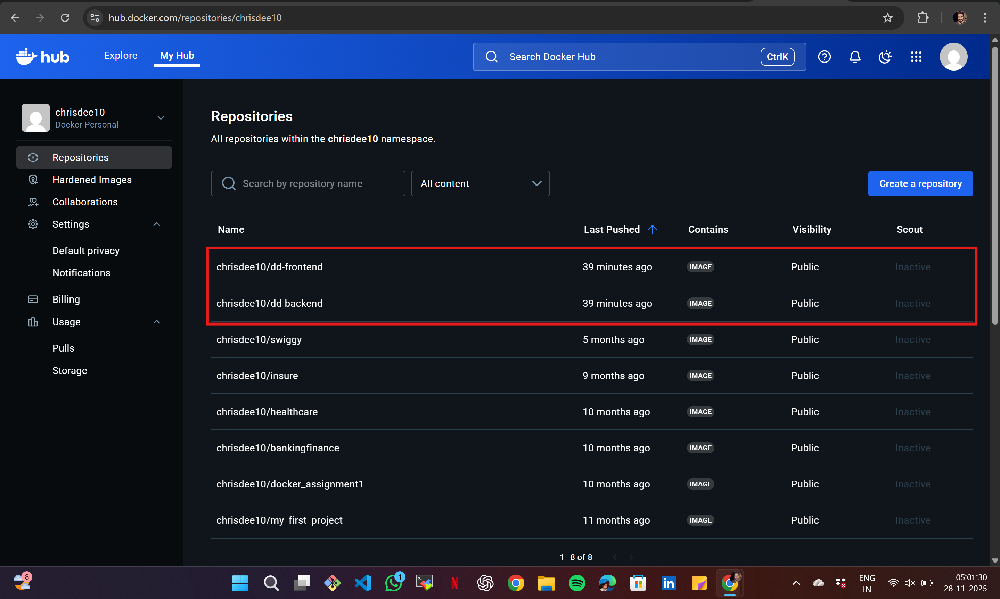
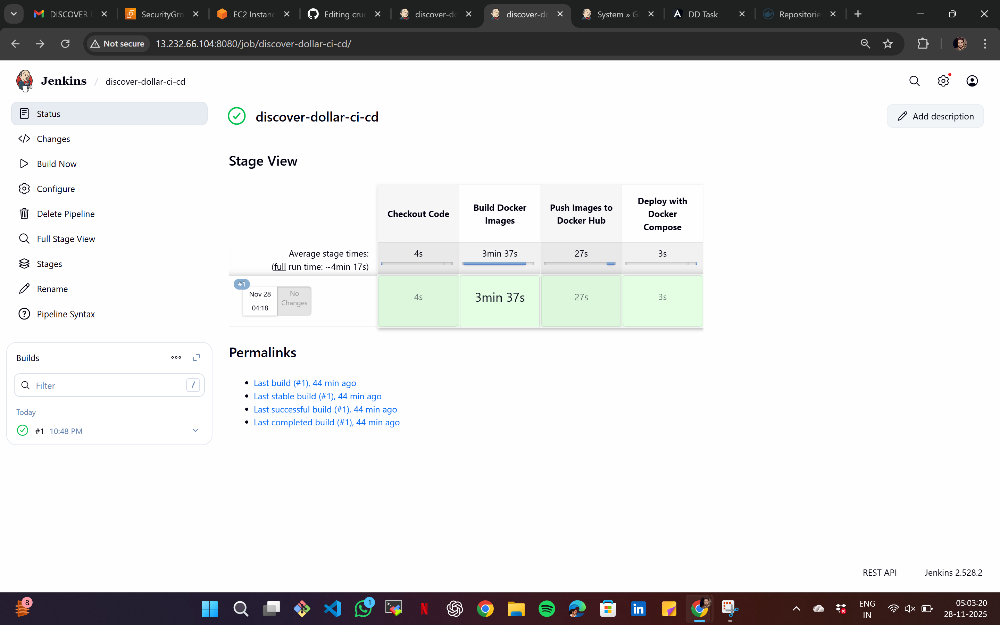
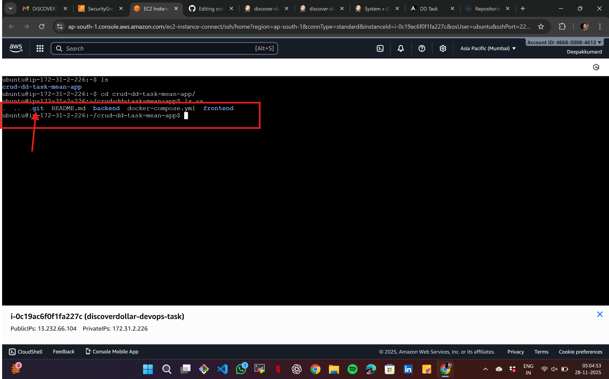
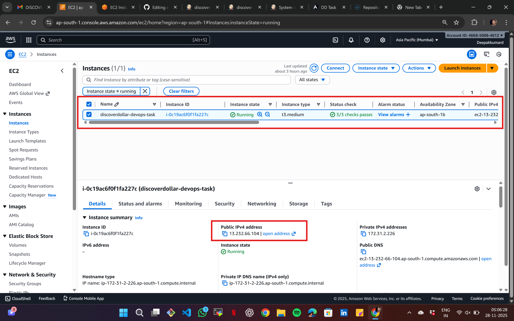

## Discover Dollar DevOps Assignment Completed ✅

This project is a containerized MEAN stack CRUD application deployed on AWS EC2 with CI/CD automation.

## Tech Stack
- MongoDB (Database)
- Node.js + Express (Backend)
- Angular 15 (Frontend)
- Nginx (Reverse Proxy + Static Hosting)
- Docker + Docker Compose
- Jenkins CI/CD
- GitHub + Docker Hub

## Features
- Add, update, delete, and search tutorials.
- Angular UI served via Nginx → backend API routed via `/api/`.
- MongoDB stores persistent tutorial records.

## Deployment Workflow
1. Code pushed to GitHub.
2. Jenkins pipeline builds Docker images for frontend & backend.
3. Jenkins pushes images to Docker Hub.
4. Jenkins runs `docker-compose pull && docker-compose up -d`.
5. Latest version automatically deployed on EC2.

Docker Hub images:
- `chrisdee10/dd-frontend:latest`
- `chrisdee10/dd-backend:latest`

CI/CD enabled with Jenkins using Docker login credentials and automated deploy.

## 📷 Screenshots

Below are screenshots of the application and deployment setup.

---

### 🖥 Application UI

---

### 🐳 Docker Containers Running (`docker ps`)

---

### 🐳 Docker Hub Repository

---

### ⚙️ CI/CD - Jenkins Pipeline View

---

### 🏗 GitHub Project Repository

---

### ☁ AWS EC2 Console (Optional)

---

